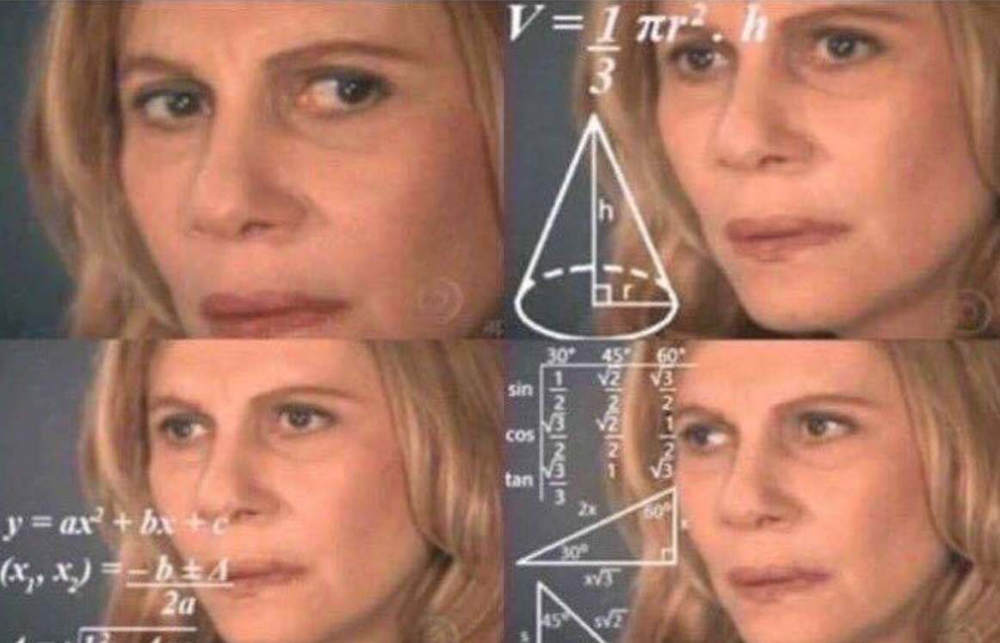

#Questions about time

- How many days has a year?
- How many hours has a day?
- How many seconds has a minute? 
--
```{r, echo=FALSE, out.width="50%", fig.align= 'right', fig.cap="Source: knowyourmeme.com"}

```
 
---
class: inverse, center, middle

# Lubridate
---

# Dates and times with Lubridate

Lubridate is installed with the tidiverse: 

```{r load-packages, include=FALSE}
library(tidyverse)  
library(lubridate)  
library(janitor)
```
```{r eval=FALSE, tidy=FALSE}
install.packages("tidyverse")  
library(lubridate)  
``` 
---
#Working with dates

- Convert date-strings to a date-time object
- Find and use the day, month or year from a Date-time object
- Convert timezones  

---
class: inverse, center, middle

# Main functions

---
#DateTime objects 

- We have dates
- POSIXct and POSIXlt classes 
--
(What?)
--

```{r}
like_date <- as.Date("2021-11-04 10:15:20") 
str(like_date)
```
--

```{r}
like_datetime_1 <- as.POSIXct("2021-11-04 10:15:20")
str(like_datetime_1) 
```

```{r}
like_datetime_2 <- as.POSIXlt("2021-11-04 10:15:20")
str(like_datetime_2) 
```

---
#Parsing date-times

- How often do we have the correct order in dates in our dataset?


- January 31, 2017
- 31 January, 2017
- 2017, January 31

--
```{r}
"2017-01-31" 
```
--
```{r}
ymd("2017-01-31") # 1. year 2. month 3. day 
```
--
```{r} 
mdy("January 31st, 2017") #  1. month 2. day 3. year
```
---
#Parsing date-times
 
````{r} 
x <- c("2021-10-01", "02022010", "02-02-2010")
parse_date_time(x, c("dmy", "ymd")) 
````

 
---
###From individual components

--
You can create a variable with datetime objects
```{r echo=FALSE}
names <- c('Lucas','Peter','Santiago')
day <- c("21", "10", "30")
month <- c('03','05','10')
year <- c('1990','1991','1992')
hour <- c('22', '20', '19')
minute <- c ('21','01','15')
birthdays_people <- data.frame(names, day, month, year, hour, minute)
birthdays_people

```
---
###From individual components
```{r}
birthdays_people_dates <- birthdays_people %>% 
  mutate(date_time_birthday = make_datetime(year, month, day, hour, minute))

birthdays_people_dates
 
```

---

# Date time components

```{r}
datetime <- ymd_hms("2016-07-08 12:34:56") 
```
--
##Getting 

--
####Taking a single value of the date
```{r}  
year(datetime) #take the year 
```
--
```{r} 
month(datetime) #take the month 
```
--
```{r} 
mday(datetime) #take the day
```  
  
  
---

# Date time components

```{r}
datetime <- ymd_hms("2016-07-08 12:34:56") 
```
--
##Setting 

--
####Changing a single value of the date
 
```{r}  
day(datetime) <- 10 #changing 8 to 10
datetime  
```
--
```{r} 
month(datetime) <- 12 #changing 7 to 12
datetime 
```
---

#Abrreviated name of month or week

```{r echo=TRUE, message=FALSE, tidy=TRUE, collapse=TRUE, comment=""}

datetime <- ymd_hms("2016-07-08 12:34:56") 

month(datetime, label = TRUE) #Taking the month name  
```
--
```{r echo=TRUE, message=FALSE, tidy=TRUE, collapse=TRUE, comment=""} 

wday(datetime, label = TRUE, abbr = FALSE) #Taking day name

```

---
#Round, floor and ceiling for dates 

```{r}
new_date <- ymd_hms("2009-08-03 12:01:59.23")  
```
--
See how different is the value from each function
```{r}  
round_date(new_date, "day") #after mid-day  
```
--
```{r} 
floor_date(new_date, "day") #before mid-day  
```
--
```{r} 
ceiling_date(new_date, "day") #after mid-day
```
---

#Round, floor and ceiling for dates 
See how it changes depending the function

```{r}
new_date_2 <- ymd_hms("2009-08-22 12:01:59.23") 
``` 
--
```{r} 
round_date(new_date_2, "month") #more September than August 
```
--
```{r} 
floor_date(new_date_2, "month") #Still September 
```
--
```{r} 
ceiling_date(new_date_2, "month") #more September than August
```
---
  
# Stamping a template to dates

```yaml
date_by_Hertie <- stamp("Created by Hertie, Jan 17, 1999 3:34") 
date_by_Esteban <- stamp("Created by Esteban, Jan 21, 2021 3:34")
date_by_Lorenzo <- stamp("Created by Lorenzo, Jan 21, 2021 3:34")
``` 
```{r include=FALSE}
date_by_Hertie <- stamp("Created by Hertie, Jan 21, 2021 3:34") # "Created by Hertie" in object
date_by_Esteban <- stamp("Created by Esteban, Jan 21, 2021 3:34") # "Created by Esteban" in object
date_by_Lorenzo <- stamp("Created by Lorenzo, Jan 21, 2021 3:34") #"Created by Lorenzo" in object
```
--
```{r}
date_by_Hertie(ymd("2010-04-05"))
```
--
```{r}
date_by_Esteban(ymd("2021-11-04")) 
```
--
```{r}
date_by_Lorenzo(ymd("2021-11-05")) 
```

---

#Timezones

Lubridate uses the IANA Timezone Database named Olson Database because of his founder Arthur Olson. The nomenclature makes easier to work with timezones.
```{r}
OlsonNames() %>% #List of Timezones
  sample(10) #Taking a sample of 30 tz
```
---
#Timezones
####Get the same data-time in different time zone

Getting the current hour in my system: Berlin, Germany
```{r} 
x_now <- now(tzone = "Europe/Berlin")
x_now
x_sys <- now(tzone = Sys.timezone()) #Current hour in my pc
x_sys

``` 
--
Getting the same hour in Bogotá, Colombia
```{r}   
berlin_to_bogota <- with_tz(x_sys, tzon="America/Bogota") #7 Hours diff
berlin_to_bogota
``` 

---
class: inverse, center, middle

# Time spans

---

# Periods, durations and intervals
 
```{r}
x_date<- ymd_hms("2021-02-27 12:00:00") 
y_date <- ymd_hms("2021-03-01 01:00:00")
```

###Intervals
Intervals are timespans that begin at a specific instant and end at a specific instant. 
```{r}
dates <- interval((x_date),(y_date)) 
dates #Dates now stores an interval of dates
```
---
###Periods
Periods track the change in the "clock time" between two date-times. 
```{r}
period_dates <- as.period(dates) 
period_dates #Change in clock time of interval
```
###Durations
Durations record the exact number of seconds in a time span.
```{r}
duration_dates <- as.duration(period_dates)
duration_dates #Seconds between the interval
```

---

#References and more about Lubridate
 
- Garrett Grolemund, Hadley Wickham (2011). Dates and Times Made Easy with lubridate. Journal of Statistical Software, 40(3), 1-25. https://www.jstatsoft.org/v40/i03/.

- Lubridate by Vitalie Spinu, Garrett Grolemund, Hadley Wickham. https://lubridate.tidyverse.org/index.html 

- Lubridate cheatsheet. https://evoldyn.gitlab.io/evomics-2018/ref-sheets/R_lubridate.pdf
---
class: center, middle
# Thanks!

Slides created via the R package [**xaringan**](https://github.com/yihui/xaringan).  